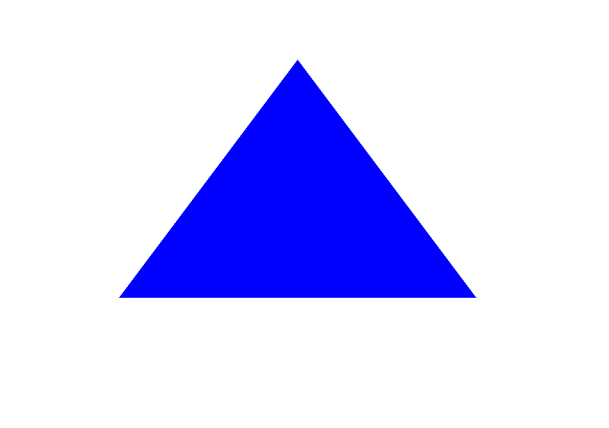

# **Software Rasterizer - Project Part 1**

**Team Members**
 **Andreas Michael**
 **Andreas Solomou**

---

**Programming Language Used**
 **Python**

---

**Image Processing Library**
This project uses the **Pillow (Python Imaging Library - PIL)** to create and manipulate images.  

**Process Used to Render the Test Triangle**
This software rasterizer follows the **edge equation-based rasterization** method as outlined in the **Modern Graphics Pipeline lecture**. Below are the five main steps used in the process.

### **Step 1: Initialize the Image and Define the Triangle**
- A blank **1024x720** white image is created as the rendering canvas.
- The triangle is defined by three vertices:  
  - **Vertex 1:** (200, 500)
  - **Vertex 2:** (500, 100)
  - **Vertex 3:** (800, 500)
- The chosen **fill color** for the triangle is **red (RGB: 255, 0, 0)**.

### **Step 2: Compute the Edge Equations**
- The **edge function equation** is calculated for each of the three triangle edges using the formula:

  \[ E(x, y) = a \cdot x + b \cdot y + c \]

  - The coefficients \( (a, b, c) \) are derived from the triangle’s vertex coordinates.
  - This equation determines whether a given pixel **(x, y)** lies inside the triangle.
  - If **all three edge equations return non-negative values**, the pixel is **inside** the triangle.

### **Step 3: Optimize Rendering with a Bounding Box**
- Instead of looping through every pixel in the image, the **bounding box** optimization is used to limit the rendering area.
- The **bounding box coordinates** are computed as follows:
  - **min_x** = smallest x-coordinate among the three vertices.
  - **max_x** = largest x-coordinate among the three vertices.
  - **min_y** = smallest y-coordinate among the three vertices.
  - **max_y** = largest y-coordinate among the three vertices.
- This step ensures that only the relevant portion of the image is processed, improving efficiency.

### **Step 4: Evaluate Edge Functions for Each Pixel**
- The program **iterates over all pixels within the bounding box**.
- For each pixel **(x, y)**:
  - The **three edge functions** are evaluated.
  - If **all three edge function values are non-negative**, the pixel is inside the triangle and is **colored blue**.
  - Otherwise, the pixel remains unchanged.

### **Step 5: Save and Display the Rendered Image**
- Once all necessary pixels are updated, the final image is saved as "image.png".

