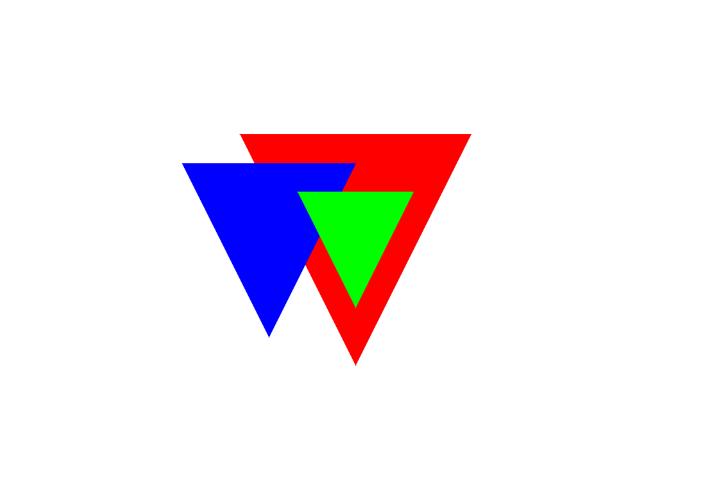

# **Software Rasterizer - Project Part 2**

**Team Members**  
**Andreas Michael**  
**Andreas Solomou**

---

**Programming Language Used**  
**Python**

---

**Image Processing Library**  
This project continues to use the **Pillow (Python Imaging Library - PIL)** for creating and manipulating images.

---

## **Overview**
In this second part of the software rasterizer project, we extend the implementation from **Part 1** to include **perspective projection** and **3D triangle rasterization**. This part demonstrates how triangles placed at different depths are rendered with the correct size and depth ordering, simulating a camera-based 3D projection.

Some functions and structure from **Project Part 1** (such as the edge-function-based rasterization and image setup) were reused and adapted to support 3D projection and depth-aware rendering.

---

## **Key Features Implemented**

### **1. Perspective Projection**
- A perspective projection formula is used to flatten 3D vertices onto a 2D image plane:
  
  \[ x' = \frac{x}{z} \cdot f \quad\quad y' = \frac{y}{z} \cdot f \]

- This simulates a realistic camera view, where objects farther away from the camera appear smaller.

### **2. 3D Triangle Setup**
- Triangles are defined in 3D space using (x, y, z) coordinates.
- Each triangle is made up of three vertices.
- Examples include triangles at various depths (z = 3, 4, 6) to demonstrate depth perception.

### **3. Depth Sorting (Painter's Algorithm)**
- Before rasterizing, triangles are **sorted using the average of the 1/z values** of their vertices.
- This ensures **correct overlap and occlusion**, with closer triangles drawn after farther ones.

### **4. Triangle Rasterization (Edge Function)**
- Reused from Part 1, the edge function determines whether a pixel lies inside a triangle.
- Bounding box optimization is also applied to reduce unnecessary pixel checks.

---

## **Rendering Result**

The final rendered image shows:
- Multiple triangles at different depths.
- The **red triangle** (z = 3) appears largest and is rendered in front.
- The **green and blue triangles** (z = 6 and z = 4) are correctly scaled and positioned behind the red triangle.

This demonstrates proper use of **perspective projection** and **depth-based triangle occlusion**.

---

## **Saved Output File**
The final render is saved as:
- `project_p2.png`

---

---

