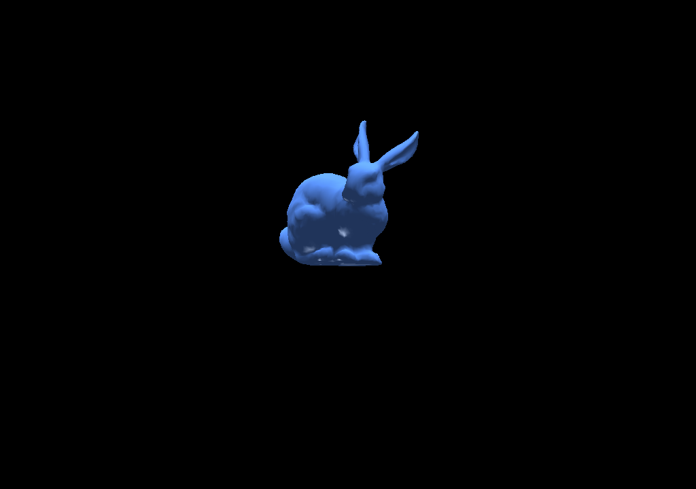

# **Software Rasterizer - Project Part 3**

**Team Members**
**Andreas Michael**
**Andreas Solomou**

---

**Programming Language Used**
**Python**

---

**Image Processing & 3D Libraries**
This project uses the following libraries:

* **Pillow (PIL)** for creating and manipulating images.
* **pywavefront** for loading 3D object files (.obj).
* **NumPy** for mathematical operations.
* **FFmpeg** for video encoding (not Python but required separately).

---

## **Overview**

In this third part of the software rasterizer project, we expand the renderer to support:

* 3D model loading using OBJ files.
* Phong shading with both diffuse and specular reflections.
* Animation through frame-by-frame rotation.
* Optimizations like bounding box pixel discard and back-face culling.

---

## **3D Object Loading**

We used `pywavefront` to load the Stanford Bunny model:

```python
scene = pywavefront.Wavefront(file_path, collect_faces=True)
```

The model is centered, normalized and rotated:

```python
v_centered = (v - center) * scale
v_rotated = rotate_y(v_centered, angle_y)
v_translated = v_rotated + np.array([0, -0.5, 5])
```

---

## **Shading with Phong Illumination**

We implemented **Phong shading** per vertex and interpolated using Gouraud shading. The material setup supports diffuse, specular and ambient terms:

```python
material = Material(
    diffuse=[80, 130, 255],
    specular=[140, 140, 140],
    shininess=16,
    mode="both"
)
```

Shading is calculated as:

```python
ambient = 0.4 * material.diffuse
specular = material.specular * (max(np.dot(view_dir, reflect_dir), 0) ** material.shininess)
diffuse = material.diffuse * max(np.dot(normal, light_dir), 0)
```

---

## **Animation**

The bunny is rotated by changing the Y-axis angle across frames:

```python
angle = frame * (360 / FRAMES)
```

Each frame is rendered and stored as:

```python
image.save(f"frames/frame_{frame_id:03d}.png")
```

After all frames are rendered:

```bash
ffmpeg -framerate 30 -i frames/frame_%03d.png -c:v libx264 -pix_fmt yuv420p output.mp4
```

---

## **Optimization: Bounding Box Pixel Discard**

Instead of looping through all pixels, we rasterize within the triangle's bounding box:

```python
min_x = max(min(x0, x1, x2), 0)
max_x = min(max(x0, x1, x2), WIDTH - 1)
min_y = max(min(y0, y1, y2), 0)
max_y = min(max(y0, y1, y2), HEIGHT - 1)
```

This significantly reduces computation per triangle.

---

## **Optimization: Back-Face Culling**

We cull triangles facing away from the camera by computing signed 2D area after projection:

```python
(x0, y0), (x1, y1), (x2, y2) = screen_coords
area_2d = (x1 - x0) * (y2 - y0) - (y1 - y0) * (x2 - x0)
if area_2d <= 0:
    continue  # skip back-facing triangle
```

This avoids rendering invisible geometry.

---

## **Media Showcase**

### **Shading and Bounding Box Output (no animation):**



### **Full Rotation without Culling:**

[](output.mp4)

### **Full Rotation with Back-Face Culling Enabled:**

[](output1.mp4)

---

This concludes the implementation of Part 3 of our software rasterizer, combining geometry processing, lighting, animation, and performance optimization into a complete rendering pipeline.


The code2 is the 3D object we created with Bounding Box, the code3 is the animation of the object with shading and Bounding Box with out culling and the code4 has all the above (3D object,shading,animatioon,Bounding Box and culling). Overall we did 5 extensions of the 3 that we had to implement.
